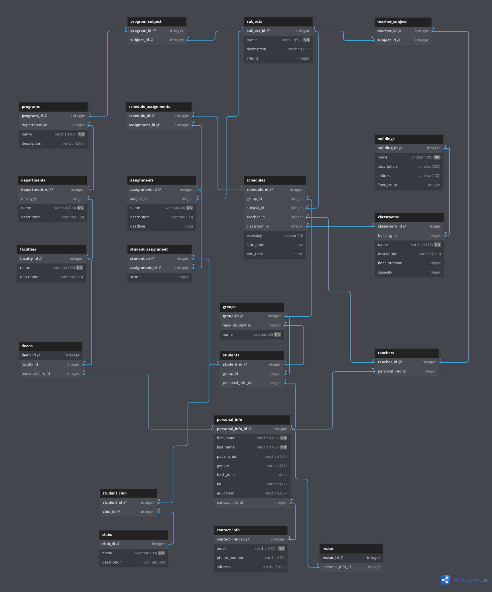

<h1 style="color: #ef75c0; text-align: center; border-bottom: none;">Lab work 2</h1>
<h2 style="color: #ef75c0; text-align: center;">Database Design. Introduction to SQL.</h1>

  

    <b style="color: #8AE6FD;">Full Name:</b>
    Daniil Kalts.
  

  

    <b style="color: #8AE6FD;">Group:</b>
    
      IT2-2404SE.
    
  

  

    <b style="color: #8AE6FD;">Goal:</b>
    
      Implement ER-diagram.
    
  

  
    <b style="color: #8AE6FD;">Task:</b>
  
  
    Visit the website
    
      <a href="https://dbdiagram.io/">dbdiagram</a> and create an ER diagram based on the <a
        href="https://github.com/DaniilKalts/iitu-labs/tree/main/1-course/1-semester/database-design-introduction-to-sql/01_database_lab">
        previous laboratory work
      </a>
    .
  

