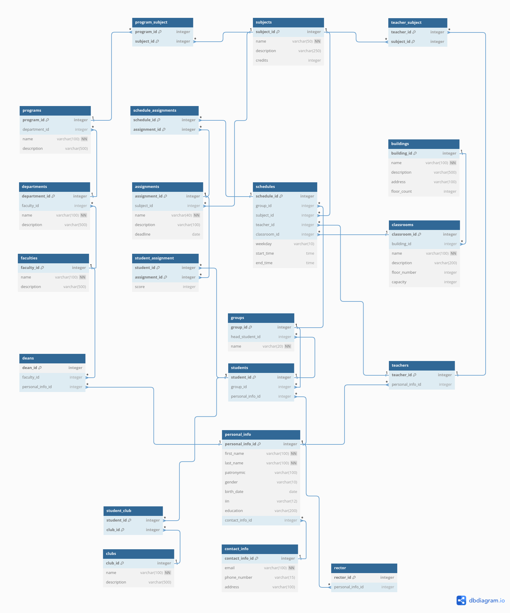

<h1 style="color: #; text-align: center; border-bottom: none;">Lab work 2</h1>
<h2 style="color: #222222; text-align: center;">Database Design. Introduction to SQL.</h1>

---

    

        <b style="color: #316896;">Full Name:</b>
        Daniil Kalts. 
    

    

        <b style="color: #316896;">Group:</b>
        
            IT2-2404SE.
        
    

    

        <b style="color: #316896;">Goal:</b>
        
            Implement ER-diagram.
        
    

    

        <b style="color: #316896;">Task:</b>
        
	        Visit the website
	        
	            <a
	                href="https://dbdiagram.io/">dbdiagram</a> and create an ER diagram based on the <a
	                href="https://github.com/DaniilKalts/iitu-labs/tree/main/1-course/1-semester/database-design-introduction-to-sql/01_database_lab"
            >	
	                previous laboratory work
		        </a>.
	        
	    
    

	

        <b style="color: #316896;">View the final result:</b>
        
			<a href="https://dbdiagram.io/d/66ef8697a0828f8aa69f7b4b">ER-diagram</a>.
        
    

