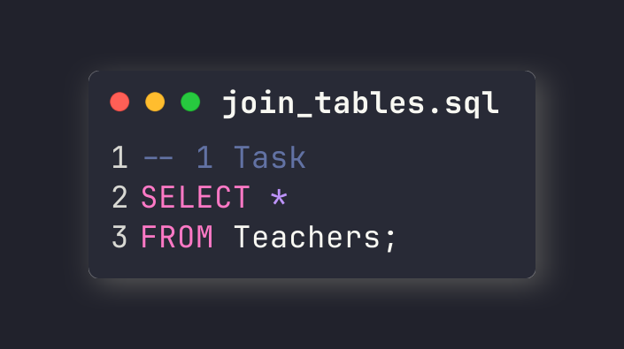

<h1 style="color: #222222; text-align: center; border-bottom: none;">Lab work 5</h1>
<h2 style="color: #222222; text-align: center;">Database Design. Introduction to SQL.</h1>

  
    <b style="color: #316896;">Full Name:</b>
  
  
    <b style="color: #316896;">Daniil Kalts.</b>
    
  
    <b style="color: #316896;">Group:</b>
  
  
    IT2-2404SE.
    
  
    <b style="color: #316896;">Goal:</b>
  
  
    to create a new database and implement SELECT queries for the following 
tasks with the PostgreSQL DBMS. 
    
  
    <b style="color: #316896;">Task:</b>
  
  <ol style="font-size: 16px; font-weight: 600;">
    <li>Show all information about all teachers.
       
    </li> 
    <li>Show last names of all students (only last names, not all columns).
       
    </li> 
    <li>Show last names of teachers whose first names = "B".
       
    </li> 
    <li>Show information about all teachers and all students in one table (with 2 columns: first name, last name).
       
    </li> 
    <li>Show information about students, but exclude persons who are both students and teachers (in a table with 2 columns: first name, last name).
       
    </li> 
    <li>Show information only about persons who are both students and teachers (in a table with 2 columns: first name, last name).
       
    </li> 
    <li>Show teachers and their departments in the following table: teachers' last name, department name. Include only teachers who have departments and departments that have teachers.
       
    </li> 
    <li>Show teachers and their departments in the following table: teachers' last name, department name. Include also teachers who currently have no department.
       
    </li> 
    <li>Show teachers and their departments in the following table: teachers' last name, department name. Include also departments that currently have no teachers.
       
    </li> 
    <li>Show teachers and their departments in the following table: teachers' last name, department name. Include teachers without departments and departments without teachers.
       
    </li> 
  </ol>
  

