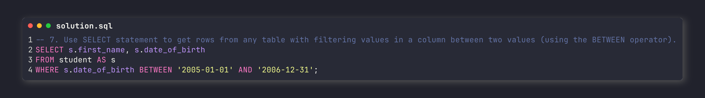

<h1 style="color: #222222; text-align: center; border-bottom: none;">Lab work 6</h1>
<h2 style="color: #222222; text-align: center;">Database Design. Introduction to SQL.</h1>

  
    <b style="color: #316896;">Full Name:</b>
  
  
    <b style="color: #316896;">Daniil Kalts.</b>
    
  
    <b style="color: #316896;">Group:</b>
  
  
    IT2-2404SE.
    
  
    <b style="color: #316896;">Goal:</b>
  
  
    to implement SELECT queries for the following tasks with the PostgreSQL DBMS.
    
  
    <b style="color: #316896;">Task:</b>
  
  <ol style="font-size: 16px; font-weight: 600;">
    <li>Use SELECT statement for any table with aliasing a result column.
       
    </li> 
    <li>Use aliasing of tables in a SELECT statement with several tables (with join 
operation).
       
    </li> 
    <li>Select data from any table and represent two different attributes in one column 
in the result table. 
       
    </li> 
    <li>Write a SELECT query to get data from any table's attribute without duplicates 
values.
       
    </li> 
    <li>Select only null or not null values of any table's attribute.
       
    </li> 
    <li>Use SELECT statement to get rows from any table with filtering values in a 
column between two values (using the <,<=,> and >= operators). 
       
    </li> 
    <li>Use SELECT statement to get rows from any table with filtering values in a 
column between two values (using the BETWEEN operator). 
       
    </li> 
    <li>Use % with LIKE operator to find some values.
       
    </li> 
    <li>Use _ with LIKE operator to find some values. 
       
    </li> 
    <li>Write a SELECT query with CAST or :: operators.
       
    </li> 
  </ol>
  

