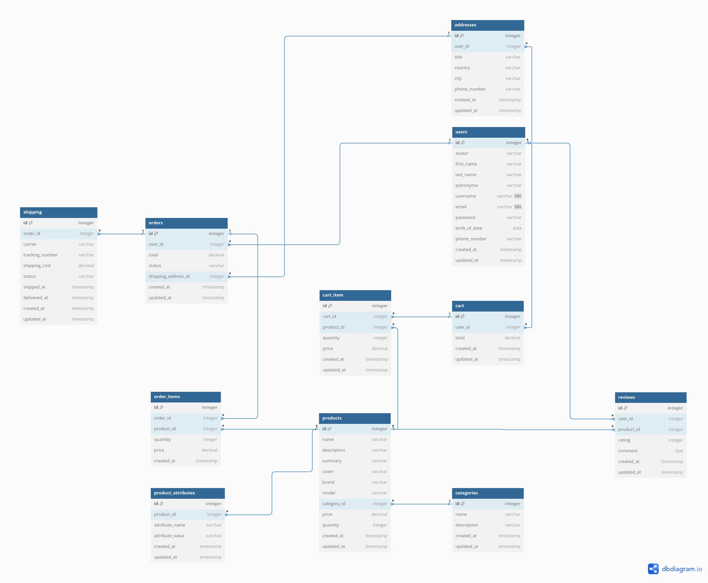

<h1 style="color: #222222; text-align: center; border-bottom: none;">E-Commerce</h1>

<h2 style="color: #222222; text-align: center;">Database Design. Introduction to SQL.</h1>

---

    

        <b style="color: #316896;">Full Name:</b>
        Daniil Kalts. 
    

    

        <b style="color: #316896;">Group:</b>
        
            IT2-2404SE.
        
    

    

        <b style="color: #316896;">Goal:</b>
        
            Make a conceptual design of database and Visualize via ER-diagram.
        
    

    

        <b style="color: #316896;">Task:</b>
        
	        List all necessary tables and attributes for the Database. Visit the website
	        
	            <a
                    href="https://dbdiagram.io/">dbdiagram</a> and create the ER diagram
		        </a>.
	        
	    
    

	

        <b style="color: #316896;">View the final result:</b>
        
			<a href="https://dbdiagram.io/d/E-commerce-Database-Design-6703cdfafb079c7ebd9812de">ER-diagram</a>.
        
    

<h2 style="color: #222222">1. What tables does the Database store?</h2>
<h3 style="color: #222222">1. The Database includes the following tables:</h3>

<ol style="color: #222222;">
  <li><b>users</b></li>
  <li><b>addresses</b></li>
  <li><b>categories</b></li>
  <li><b>products</b></li>
  <li><b>product_attributes</b></li>
  <li><b>cart</b></li>
  <li><b>cart_item</b></li>
  <li><b>orders</b></li>
  <li><b>order_items</b></li>
  <li><b>reviews</b></li>
  <li><b>shipping</b></li>
</ol>

<h2 style="color: #222222">2. What attributes does the Database store?</h2>

<h3 style="color: #222222">2. The Database includes the following attributes for each table:</h3>

<ol style="color: #222222;">
  <li><b>users:</b>
    <ul>
      <li>id: integer (PK)</li>
      <li>avatar: varchar</li>
      <li>first_name: varchar</li>
      <li>last_name: varchar</li>
      <li>patronymic: varchar</li>
      <li>username: varchar (not null, unique)</li>
      <li>email: varchar (not null, unique)</li>
      <li>password: varchar</li>
      <li>birth_of_date: date</li>
      <li>phone_number: varchar</li>
      <li>created_at: timestamp</li>
      <li>updated_at: timestamp</li>
    </ul>
  </li>
  <li><b>addresses:</b>
    <ul>
      <li>id: integer (PK)</li>
      <li>user_id: integer (FK to users.id)</li>
      <li>title: varchar</li>
      <li>country: varchar</li>
      <li>city: varchar</li>
      <li>phone_number: varchar</li>
      <li>created_at: timestamp</li>
      <li>updated_at: timestamp</li>
    </ul>
  </li>
  <li><b>categories:</b>
    <ul>
      <li>id: integer (PK)</li>
      <li>name: varchar</li>
      <li>description: varchar</li>
      <li>created_at: timestamp</li>
      <li>updated_at: timestamp</li>
    </ul>
  </li>
  <li><b>products:</b>
    <ul>
      <li>id: integer (PK)</li>
      <li>name: varchar</li>
      <li>description: varchar</li>
      <li>summary: varchar</li>
      <li>cover: varchar</li>
      <li>brand: varchar</li>
      <li>model: varchar</li>
      <li>category_id: integer (FK to categories.id)</li>
      <li>price: decimal</li>
      <li>quantity: integer</li>
      <li>created_at: timestamp</li>
      <li>updated_at: timestamp</li>
    </ul>
  </li>
  <li><b>product_attributes:</b>
    <ul>
      <li>id: integer (PK)</li>
      <li>product_id: integer (FK to products.id)</li>
      <li>attribute_name: varchar</li>
      <li>attribute_value: varchar</li>
      <li>created_at: timestamp</li>
      <li>updated_at: timestamp</li>
    </ul>
  </li>
  <li><b>cart:</b>
    <ul>
      <li>id: integer (PK)</li>
      <li>user_id: integer (FK to users.id)</li>
      <li>total: decimal</li>
      <li>created_at: timestamp</li>
      <li>updated_at: timestamp</li>
    </ul>
  </li>
  <li><b>cart_item:</b>
    <ul>
      <li>id: integer (PK)</li>
      <li>cart_id: integer (FK to cart.id)</li>
      <li>product_id: integer (FK to products.id)</li>
      <li>quantity: integer</li>
      <li>price: decimal</li>
      <li>created_at: timestamp</li>
      <li>updated_at: timestamp</li>
    </ul>
  </li>
  <li><b>orders:</b>
    <ul>
      <li>id: integer (PK)</li>
      <li>user_id: integer (FK to users.id)</li>
      <li>total: decimal</li>
      <li>status: varchar</li>
      <li>shipping_address_id: integer (FK to addresses.id)</li>
      <li>created_at: timestamp</li>
      <li>updated_at: timestamp</li>
    </ul>
  </li>
  <li><b>order_items:</b>
    <ul>
      <li>id: integer (PK)</li>
      <li>order_id: integer (FK to orders.id)</li>
      <li>product_id: integer (FK to products.id)</li>
      <li>quantity: integer</li>
      <li>price: decimal</li>
      <li>created_at: timestamp</li>
    </ul>
  </li>
  <li><b>reviews:</b>
    <ul>
      <li>id: integer (PK)</li>
      <li>user_id: integer (FK to users.id)</li>
      <li>product_id: integer (FK to products.id)</li>
      <li>rating: integer (1 to 5)</li>
      <li>comment: text</li>
      <li>created_at: timestamp</li>
      <li>updated_at: timestamp</li>
    </ul>
  </li>
  <li><b>shipping:</b>
    <ul>
      <li>id: integer (PK)</li>
      <li>order_id: integer (FK to orders.id)</li>
      <li>carrier: varchar</li>
      <li>tracking_number: varchar</li>
      <li>shipping_cost: decimal</li>
      <li>status: varchar</li>
      <li>shipped_at: timestamp</li>
      <li>delivered_at: timestamp</li>
      <li>created_at: timestamp</li>
      <li>updated_at: timestamp</li>
    </ul>
  </li>
</ol>

